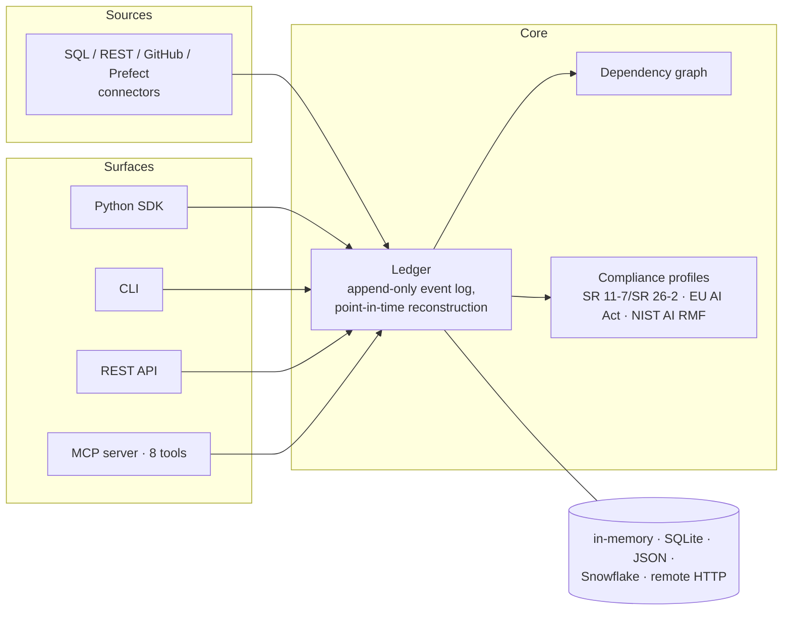

# model-ledger

**git for models** — know what models you have deployed, where they run, what they depend on, and what changed.

[](https://github.com/block/model-ledger/actions/workflows/ci.yml)
[](LICENSE)
[](https://python.org)
[](https://pypi.org/project/model-ledger/)
[](https://pypistats.org/packages/model-ledger)
[](https://block.github.io/model-ledger/)

📖 **[Documentation](https://block.github.io/model-ledger/)** &middot;
[Quickstart](https://block.github.io/model-ledger/quickstart/) &middot;
[Concepts](https://block.github.io/model-ledger/concepts/) &middot;
[Governance](https://block.github.io/model-ledger/governance/)

---

model-ledger is a model inventory for any organization with deployed models. It
**discovers** models, heuristic rules, and ETL across your platforms, maps the
**dependency graph** automatically, and records **every change as an immutable event**.
Unlike registries tied to a single platform (MLflow, SageMaker, W&B), it spans all of
them — as one connected graph — and it's built to be driven by AI agents through a
native MCP server.

Benchmarked at production scale: full inventory reconstruction over a ledger of 28.8k
models and 212k events runs in under a second ([CHANGELOG, v0.7.4](CHANGELOG.md)).

## Install

```bash
pip install model-ledger
```

## The graph builds itself

Every model is a `DataNode` with typed input and output ports. When an output port name
matches an input port name, `connect()` creates the dependency edge — no hand-wiring.

```python
from model_ledger import Ledger, DataNode

ledger = Ledger()

ledger.add([
    DataNode("segmentation", platform="etl",      outputs=["customer_segments"]),
    DataNode("fraud_scorer", platform="ml",       inputs=["customer_segments"], outputs=["risk_scores"]),
    DataNode("fraud_alerts", platform="alerting", inputs=["risk_scores"]),
])
ledger.connect()

ledger.trace("fraud_alerts")
# ['segmentation', 'fraud_scorer', 'fraud_alerts']
```

Every mutation is recorded as an immutable **Snapshot** — an append-only event log that
gives you full history and point-in-time reconstruction, because nothing is overwritten.

## Talk to your inventory

The MCP server is a first-class surface — point Claude (or any MCP agent) at it:

```bash
pip install "model-ledger[mcp]"
claude mcp add model-ledger -- model-ledger mcp --demo
```

> **You:** if we deprecate `customer_features`, what breaks?
>
> **Claude:** 3 models consume it directly, 2 more transitively.

## Documentation

Everything lives at **[block.github.io/model-ledger](https://block.github.io/model-ledger/)** —
and it can't drift, because the API reference is generated from source and every example
runs in CI:

- **[Quickstart](https://block.github.io/model-ledger/quickstart/)** — install to your first dependency trace in 60 seconds
- **[Concepts](https://block.github.io/model-ledger/concepts/)** — DataNode, Snapshot, and Composite, in three ideas
- **[Agents (MCP)](https://block.github.io/model-ledger/guides/agents/)** — the eight-tool agent surface, with a worked transcript
- **[Connectors](https://block.github.io/model-ledger/guides/connectors/)** — discover from SQL, REST, GitHub, or your own platform
- **[Backends](https://block.github.io/model-ledger/guides/backends/)** — in-memory, SQLite, JSON, Snowflake, or remote HTTP
- **[Governance](https://block.github.io/model-ledger/governance/)** — how the primitives map to SR 11‑7/SR 26‑2, the EU AI Act, and NIST AI RMF
- **[API reference](https://block.github.io/model-ledger/reference/)** — generated from the source

## Architecture



## For organizations

The OSS core handles discovery, graph building, change tracking, storage, the agent
protocol, and compliance validation — the SR 11‑7/SR 26‑2, EU AI Act Annex IV, and
NIST AI RMF profiles ship in `model_ledger.validate`. Your internal package provides
only the thin layer on top: connector configs, custom connectors for internal
platforms, and credentials. Thin config, not reimplemented logic.

## Contributing

See [CONTRIBUTING.md](https://github.com/block/model-ledger/blob/main/CONTRIBUTING.md).
All commits require DCO sign-off.

## Security

See [SECURITY.md](SECURITY.md) for how to report vulnerabilities privately.

## License

Apache-2.0. See [LICENSE](https://github.com/block/model-ledger/blob/main/LICENSE).

Created and maintained by [Vignesh Narayanaswamy](https://github.com/vigneshnarayanaswamy) at Block.

<!-- mcp-name: io.github.block/model-ledger -->
